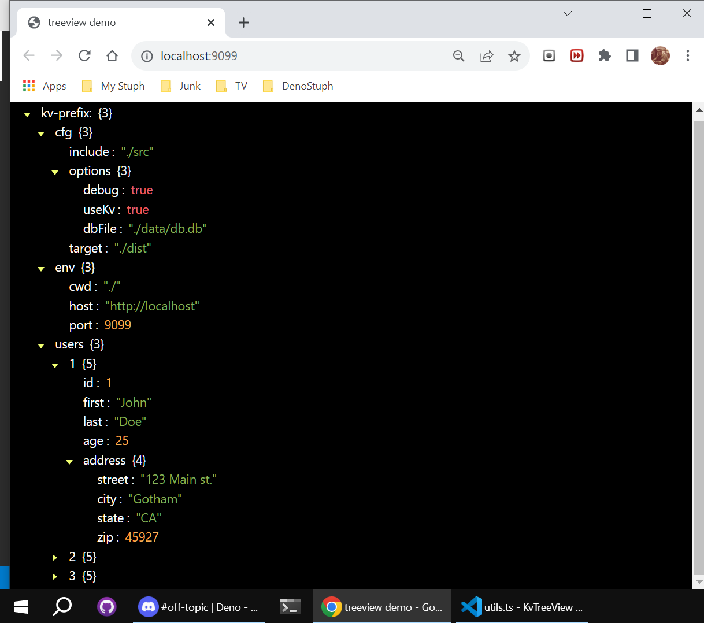

# Kv-Viewer
This is an example application for examining DenoKv data in a TreeView.   
This app uses a simple RPC service to fetch and prep all DenoKv-db-rows    
for viewing in a DOM Treeview.  

## WARNING: 
This is an unfinished work that was testing the concept of showing multipart-keys in a tree format.  Many features are yet to be implemented.  This work has now been rolled into another db project that has the ability to use many peristence layers. 

This simple client demonstrates a minimal transaction-based SSE-KV-RPC service.   
See: _./dbService/dbtransactions.ts/_ (server-side) and _./example/dbClient.js/_ (client-side)

This example supplies a test database located in _**/dbService/data/db.db**_    
You may change this to any other DenoKv file by modifying the **DBPath**    
constant found in the _./dbService/context.ts_ file.

### Usage:

Make a local copy of this repo.    
In the project root, enter:
```
deno run -A --unstable server.ts
```
This server will automatically open the app at localhost:9099 in your default browser.   

